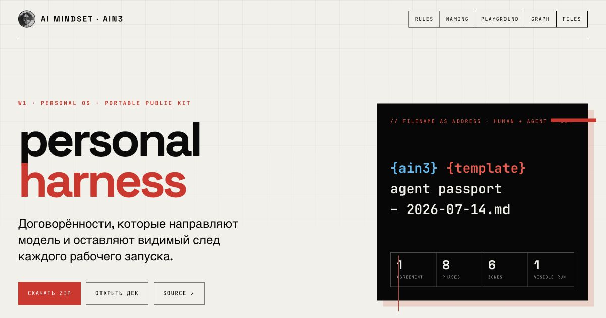

<p align="center">
  
</p>

<h1 align="center">ainative · lab 3</h1>

<p align="center">
  <b>AI-Native Sprint III</b> · 13 июля – 3 августа 2026 · AI Mindset<br>
  договорённости, которые направляют модель в нужное русло и оставляют проверяемый след
</p>

<p align="center">
  <a href="https://ai-mindset-org.github.io/ainative-lab-3/">hub</a> ·
  <a href="https://ai-mindset-org.github.io/ainative-lab-3/graph/">graph</a> ·
  <a href="https://ai-mindset-org.github.io/ainative-lab-3/starter-pack/naming/">naming builder</a> ·
  <a href="https://ai-mindset-org.github.io/ainative-deck/decks/ain3-personal-setup/">deck</a> ·
  <a href="https://learn.aimindset.org/ain3">lms</a>
</p>

---

## Что это

Рабочие поверхности лабы AIN3 – всё, что участник уносит с собой после сессии «мой персональный harness»: карта системы, конвенции, правила, шаблоны и два стартовых скилла. Третий поток, сестра [ainative-lab-2](https://github.com/ai-mindset-org/ainative-lab-2).

Ядро метода: **один процесс · один контекст · один прогон · один след.**

## С чего начать

1. Прочитай [setup.md](setup.md) – слоёная модель 4+1, пять фактов, которые меняют сетап, и маршрут сборки за вечер.
2. Склонируй [starter-pack/](starter-pack/) или скачай [ZIP](starter-pack/ain3-personal-harness-starter-pack.zip).
3. Заполни operating brief → source map → router → первый SKILL.md → первый прогон → строка evidence.

## Карта репозитория

```
ainative-lab-3/
├── index.html            hub – витрина всех поверхностей
├── setup.md              как собрать свой pack за вечер: 4+1 слоя, 5 стадий, handoff
├── operating-rules.md    правила личного harness по шести зонам – из реальной системы
├── naming-convention.md  конвенция про конвенции: грамматика, типы, анти-паттерны, мета-правило
├── presentation.md       структура деки (18 секций) + карта хранения всех поверхностей
├── graph/                интерактивная карта harness – 39 узлов, 72 связи, 6 категорий
├── data/manifest.json    данные графа
├── assets/               логотип AIM, обложка
└── starter-pack/         переносимый participant kit:
    ├── AGENTS.md.template · CLAUDE.md.template     router для агента
    ├── naming/                                      live filename builder
    ├── operating-brief-template.md                  trigger · inputs · output · owner · DoD
    ├── source-map-template.md                       3–5 источников: why + access
    ├── agent-passport-template.md · agent-registry-template.md
    ├── skills/operating-brief/ · skills/process-audit/
    ├── evidence-log-template.md · refresh-ritual.md
    └── demo/one-workflow-seed.md                    заполненный пример
```

## Шесть зон harness

`context` – что агент знает до задачи · `memory` – что переживает сессию · `guardrail` – границы и паспорта · `review` – проверяемый след · `naming` – адресация · `communication` – люди и агенты в одном контуре.

Каждая зона раскрыта в [operating-rules.md](operating-rules.md); связи между ними видны в [графе](https://ai-mindset-org.github.io/ainative-lab-3/graph/).

## Provenance

Конденсат операционного опыта [AI Mindset](https://aimindset.org) 2024–2026: 200+ production-скиллов, 13K+ заметок в Obsidian, кросс-инструментный синк Claude Code ↔ Codex, evidence-петля на каждый содержательный ответ. Всё в этом репозитории проверено эксплуатацией.

Делитесь свободно, упоминайте AIM, если помогло.
